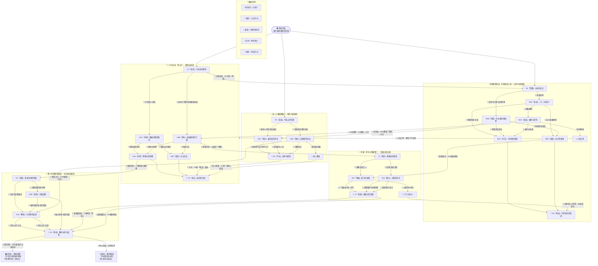
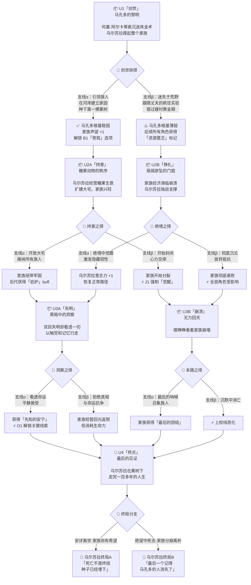
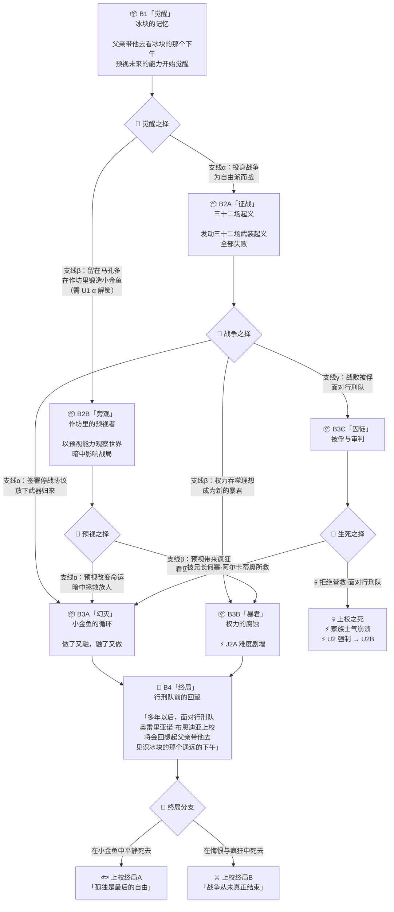
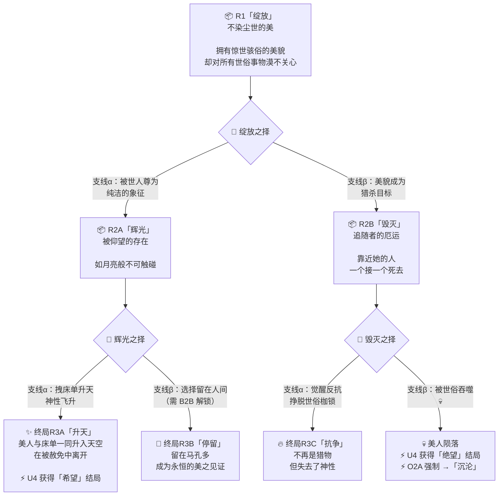
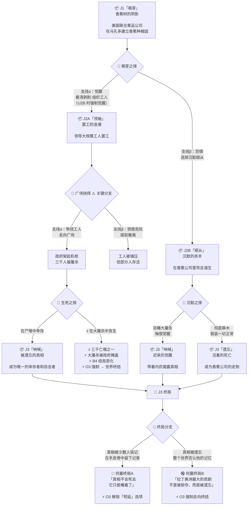
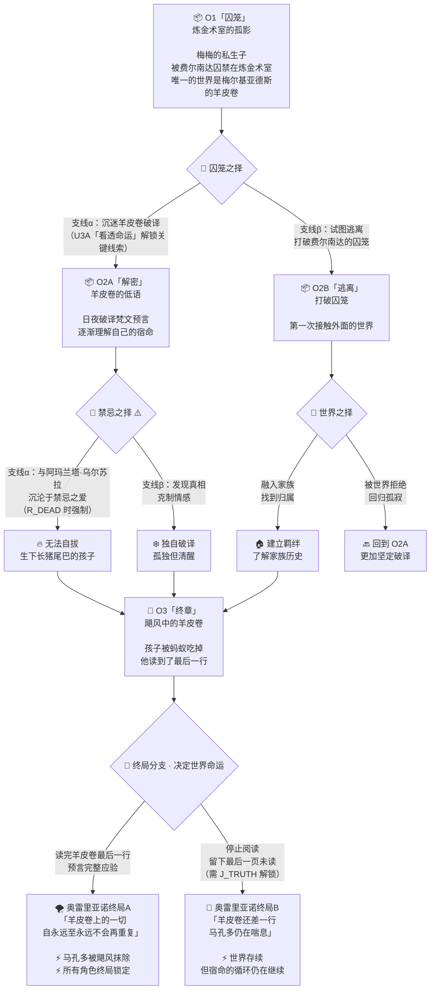
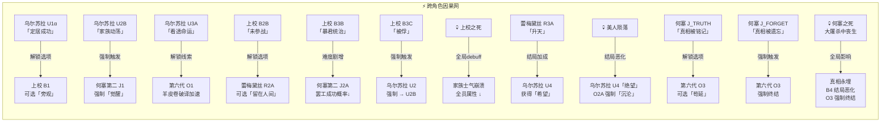
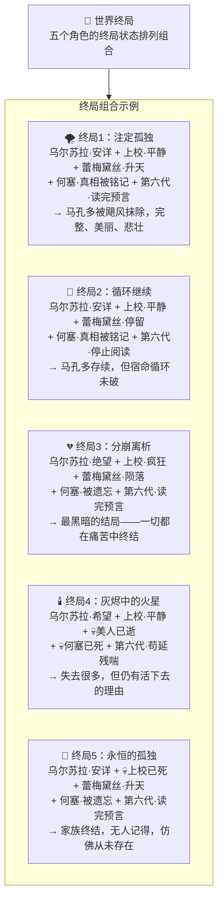

# 🎮 百年孤独 · 宿命之环 — 大章节流程图

> 五主角 · 底特律变人式分支叙事
> 图例：📦 大章节节点 → 🔀 分支 → 📦 下一大章 | ⚡ 跨角色影响

---

## 一、全局总览图

---

## 二、乌尔苏拉线 · 详细分支

---

## 三、奥雷里亚诺上校线 · 详细分支

---

## 四、美人儿蕾梅黛丝线 · 详细分支

---

## 五、何塞·阿尔卡蒂奥第二线 · 详细分支

---

## 六、第六代奥雷里亚诺线 · 详细分支

---

## 七、全局因果网（跨角色影响总表）

---

## 八、终局组合矩阵

---

## 📋 设计说明

| 层级 | 判定方式 | 示例 |
|---|---|---|
| **大章流转** | 因果链（上一个支线 → 下一个大章） | U1α定居成功 → U2A持家 |
| **小章判定** | 数值阈值（属性判定） | 口才≥7 说服长老 / <7 触发战斗 |
| **跨角色影响** | 标记位（flag）传递 | 上校死亡 → 全局「士气崩溃」flag |
| **终局** | 五角色终局状态排列组合 | 5角色 × 各2-4终局状态 = 多种组合 |

---

> 📌 下一步：确认大章框架后，进入小章节数值系统设计
